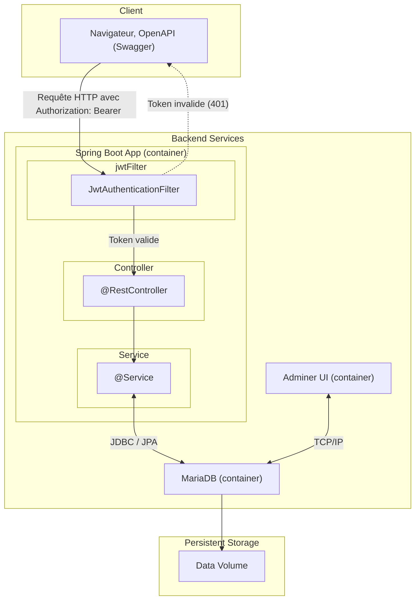

[⬅ Retour au README](../README.md)

# Architecture des Conteneurs - Application Spring, MariaDB, Adminer

```mermaid
flowchart TB
    subgraph Client["Client"]
        client["Navigateur, OpenAPI (Swagger)"]
    end

    subgraph Backend["Backend Services"]
        subgraph SpringBootApp["Spring Boot App (container)"]
            direction TB

            subgraph SecurityFilter["jwtFilter"]
                jwtFilter["JwtAuthenticationFilter"]
            end


            subgraph ControllerLayer["Controller"]
                controller["@RestController"]
            end

            subgraph ServiceLayer["Service"]
                service["@Service"]
            end
        end

        db["MariaDB (container)"]
        adminer["Adminer UI (container)"]
    end

    subgraph Storage["Persistent Storage"]
        vol1["Data Volume"]
    end

    client -->|"Requête HTTP avec Authorization: Bearer <token_jwt>"| jwtFilter
    jwtFilter -->|"Token valide"| controller
    jwtFilter -.->|"Token invalide (401)"| client

    controller --> service
    service <-->|"JDBC / JPA"| db

    adminer <-->|"TCP/IP"| db
    db --> vol1
```
