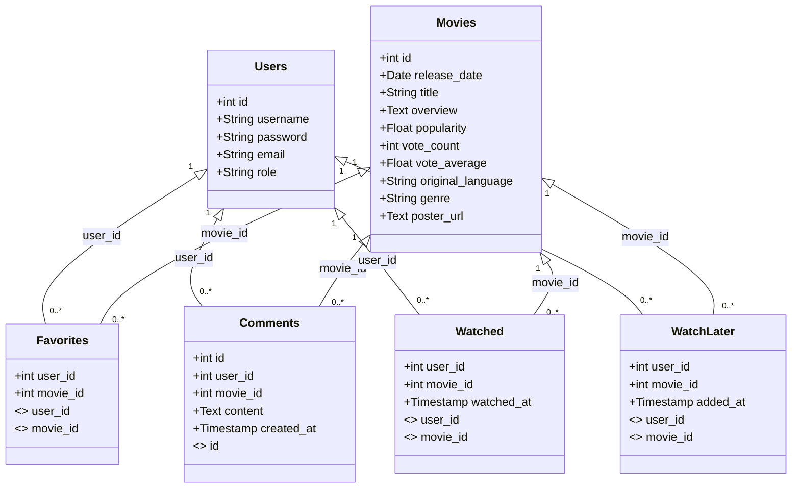

[⬅ Retour au README](../README.md)

# Schéma de la base de données

```mermaid
classDiagram
class Users {
+int id
+String username
+String password
+String email
+String role
}

    class Movies {
        +int id
        +Date release_date
        +String title
        +Text overview
        +Float popularity
        +int vote_count
        +Float vote_average
        +String original_language
        +String genre
        +Text poster_url
    }

    class Favorites {
        +int user_id
        +int movie_id
        <<PK>> user_id
        <<PK>> movie_id
    }

    class Comments {
        +int id
        +int user_id
        +int movie_id
        +Text content
        +Timestamp created_at
        <<PK>> id
    }

    class Watched {
        +int user_id
        +int movie_id
        +Timestamp watched_at
        <<PK>> user_id
        <<PK>> movie_id
    }

    class WatchLater {
        +int user_id
        +int movie_id
        +Timestamp added_at
        <<PK>> user_id
        <<PK>> movie_id
    }

    %% Relations
    Users "1" <|-- "0..*" Favorites : user_id
    Movies "1" <|-- "0..*" Favorites : movie_id

    Users "1" <|-- "0..*" Comments : user_id
    Movies "1" <|-- "0..*" Comments : movie_id

    Users "1" <|-- "0..*" Watched : user_id
    Movies "1" <|-- "0..*" Watched : movie_id

    Users "1" <|-- "0..*" WatchLater : user_id
    Movies "1" <|-- "0..*" WatchLater : movie_id
```