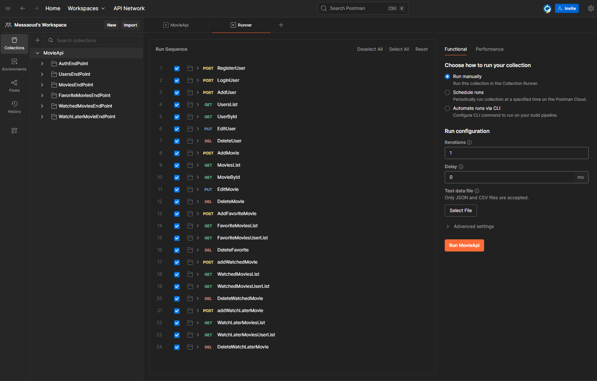
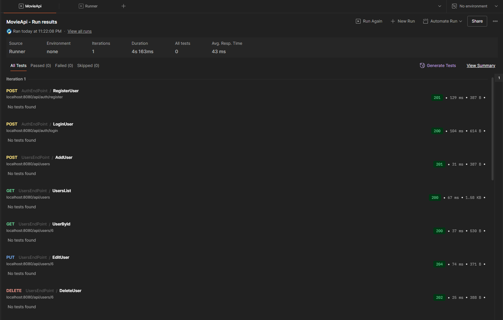

[⬅ Retour au README](../README.md)

Tests des Endpoints avec Postman
---
La **collection Postman** permet de tester facilement **tous les endpoints de l’API MovieApp**, incluant l’authentification, les opérations CRUD sur les films, utilisateurs et les vérifications de statut.

## Importation de la collection

1. Ouvre **Postman**
2. Clique sur **Import**
3. Sélectionne le fichier :  monitoring/postman/MovieApi.postman_collection.json
4. La collection **MovieApp API** apparaîtra dans ta barre latérale.

---

## Configuration :

Avant d’exécuter les requêtes ajoute les variables :

   | Variable | Valeur par défaut |
   |-----------|------------------|
   | `base_url` | `http://localhost:8080/api` |
   | `jwt_token` | (sera rempli automatiquement après login) |

---

## Exécution des tests automatisés

La collection peut être exécutée intégralement via le Postman Runner, permettant d’effectuer une vérification complète de l’API de bout en bout.
- de vérifier les codes HTTP (200, 201, 401, 404, etc.)
- de valider la structure du JSON de réponse

---

## Résultats

- **Vert ✅** → Endpoint fonctionnel
- **Rouge ❌** → Erreur API (authentification, validation ou serveur selon les codes HTTP)

